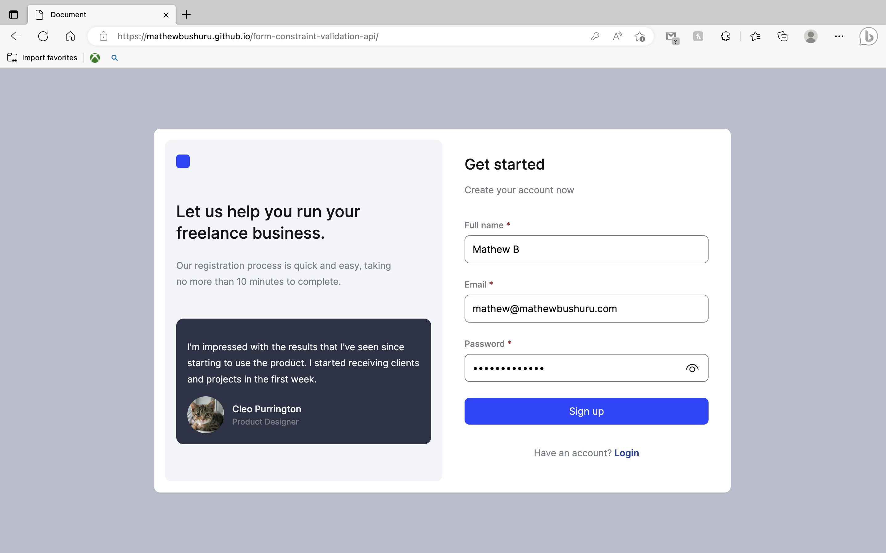

### Form validation

A simple sign up form. It uses JavaScript's constraint validation API to inform user of the validation status that is more informative than the default HTML 5 input validation messages.

Design credit: [Dribbble](https://dribbble.com/shots/20453169-Get-Started-Screen)

##### Roadmap
- [x] HTML Markup + CSS styling
- [x] Mobile responsive
- [x] Default validation with HTML 5 inputs
- [x] Add custom validation feedback with Constraint Validation API.
- [ ] Incorporate `zod` and `react-hook-form` for more robust validation.

